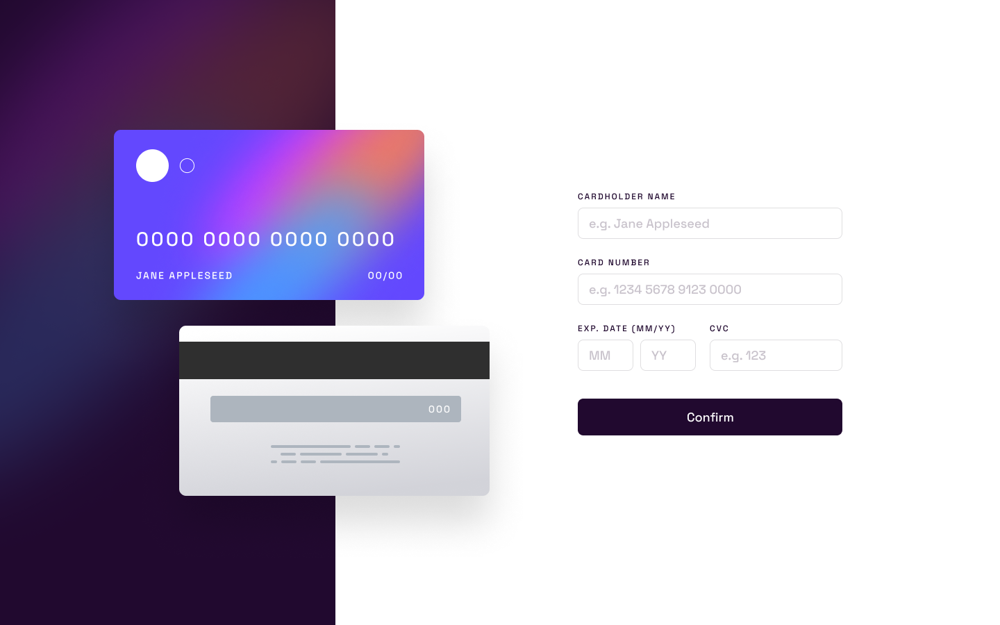
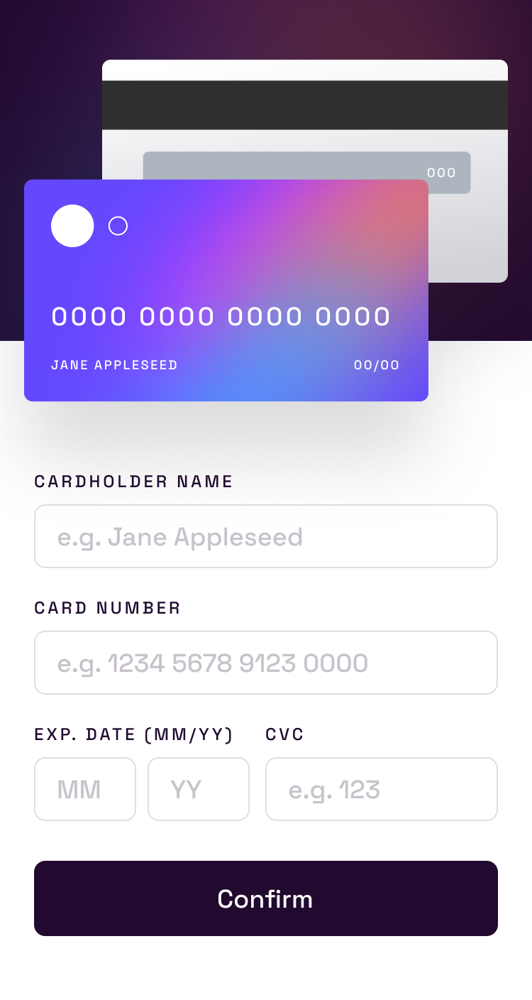

# Interactive card details form
Your challenge is to build this interactive card details form and make it look as close as possible to the design.

### Final Project Overview






## Summary

- [Overview](#overview)
  - [Challenge](#challenge)
  - [Screenshot](#screenshot)
  - [Links](#links)
- [My Process](#my-process)
  - [Built With](#built-with)
  - [What I Learned](#what-i-learned)
  - [Continued Development](#continued-development)
  - [Useful Resources](#useful-resources)
- [Author](#author)
- [Acknowledgments](#acknowledgments)


## Overview

### Challenge
You can use any tools you want to help you complete the challenge. So, if you have something you'd like to practice, feel free to try it out.

Your users should be able to:

- Fill in the form and see the card details updated in real-time
- Receive error messages when the form is submitted if:
   - Any input field is empty
   - The card number, expiry date, or CVC fields are in the wrong format
- Display the ideal layout depending on the device screen size
- Refer to the focus, active, and hover states for interactive elements on the page

### Screenshot


### Links

- [Source code](https://github.com/Otaviano-Manoel/interactive_card_details_form)
- [Live website](https://otaviano-manoel.github.io/interactive_card_details_form/)

## My Process

### Built With


### What I Learned
- Code organization: I learned the importance of keeping the code clean and well-organized. With the help of ChatGPT, I was able to find the best formatting for my files, making them more readable and easier to maintain.

- Use of React hooks: I learned to use various React hooks such as `useState`, `useEffect`, `useRef`, and `useNavigate`. These hooks allowed me to manage state and side effects more efficiently.

```jsx
//Example of using Hooks.
  import React, { useState, useEffect, useRef } from 'react';

  const ExampleComponent = () => {
    const [count, setCount] = useState(0);
    const countRef = useRef();

    useEffect(() => {
      countRef.current = count;
      console.log(`O contador é: ${countRef.current}`);
    }, [count]);

    return (
      <div>
        <p>Contador: {count}</p>
        <button onClick={() => setCount(count + 1)}>Incrementar</button>
      </div>
    );
  };
```

Use of React Router: I learned to use React Router to manage navigation in my application. This included setting up routes and programmatic navigation using the useNavigate hook.

```jsx
//Example of using react-router-dom.
import React from 'react';
import { BrowserRouter as Router, Route, Routes, useNavigate } from 'react-router-dom';

const Home = () => {
  const navigate = useNavigate();
  return (
    <div>
      <h1>Home</h1>
      <button onClick={() => navigate('/about')}>Ir para Sobre</button>
    </div>
  );
};

const About = () => <h1>Sobre</h1>;

const App = () => (
  <Router>
    <Routes>
      <Route path="/" element={<Home />} />
      <Route path="/about" element={<About />} />
    </Routes>
  </Router>
);

export default App;
```

### Continued Development

There are several parts of the project that I would like to improve in the future to make it even more robust and efficient.

- The responsiveness of the website: Although the site is currently responsive, there are areas that could be optimized to offer a smoother user experience across all devices. I plan to review and enhance the media queries and flexible layout.

- The organization of the code: Despite paying a lot of attention to organization, I had to restart the project once due to initial disorganization. I will continue to refine the code structure and seek best practices to keep everything well organized from the start.


### Useful Resources

- [MDN Web Docs](https://developer.mozilla.org/) - A complete and reliable reference for HTML, CSS, and JavaScript functions and properties. I used it extensively to better understand certain functionalities and best practices.

- [W3Schools](https://www.w3schools.com/) - A valuable resource for learning and referencing HTML, CSS, and React functions. Their explanations and examples helped to quickly clarify doubts.

- [React Documentation](https://reactjs.org/docs/getting-started.html) - The official React documentation was essential for understanding how to use hooks, routing, and other React features correctly and efficiently.

- [ChatGPT](https://www.openai.com/chatgpt) - I used ChatGPT to solve some complex logic and problems I encountered during development. It was helpful for obtaining solutions and code formatting suggestions.


## Author
[Frontend Mentor - @Otaviano-Manoel](https://www.frontendmentor.io/profile/Otaviano-Manoel)

## Acknowledgments

I thank everyone who took the time to view my project. I am in the learning phase and continue to seek to improve my skills to achieve clearer and more functional code. Your feedback is very valuable to me and will be fundamental to my growth as a developer.
